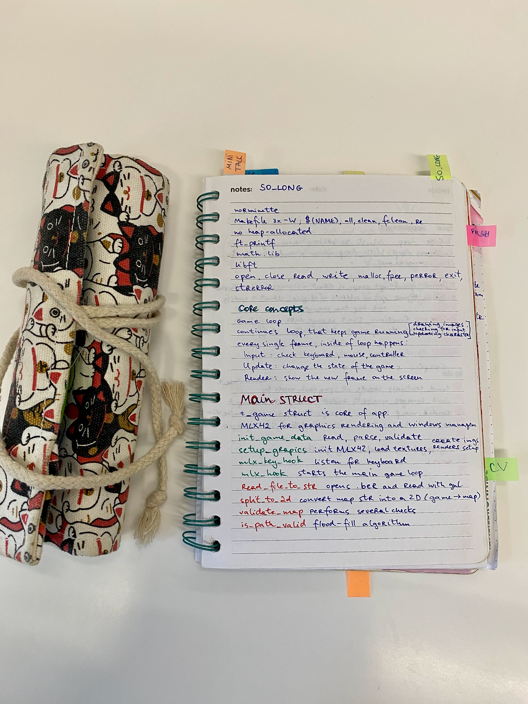
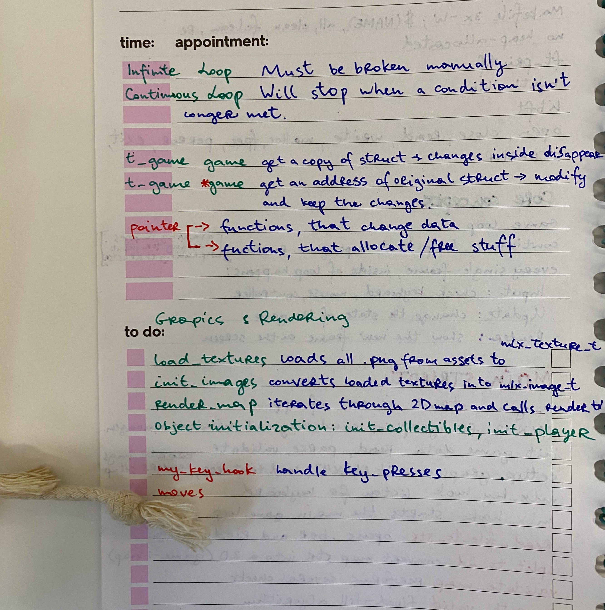

# 🐤 Sooooooooo loooooong
This project took me waaay longer than expected 😅  
Most of the time wasn’t even coding, but:  
- digging through the MLX docs to understand which functions I actually need  
- spending *hours* choosing the “perfect” avatar and grass textures 🌱  

In the end… I just went with a **small duck** and a **big apple** 🍏🐤  
---


# ⚙️ Requirements 

## 📦 General
- **Program name:** `so_long`  
- **Files to submit:** `Makefile`, `*.h`, `*.c`, `maps/`, `textures/`  
- **Makefile rules:** `NAME`, `all`, `clean`, `fclean`, `re`  
- **Arguments:** one map file with `.ber` extension  
- **Libs allowed:**  
  - Standard: `open`, `close`, `read`, `write`, `malloc`, `free`, `perror`, `strerror`, `exit`  
  - Math library (`-lm`)  
  - MiniLibX functions  
  - `gettimeofday()`  
  - Your own `ft_printf` (or equivalent you coded)  
- **Libft:** allowed  

---

## 🎮 Game Rules
- Player must **collect all collectibles** and then **escape through the exit**.  
- Controls: `W A S D` (or arrows / ZQSD).  
- Movement: up, down, left, right.  
- Cannot move into walls.  
- Each move → **print move counter** in shell.  
- Use **2D view** (top-down or profile).  
- Game doesn’t need to be real-time.  
- Theme is free (dolphin/fish example is optional).  

---

## 🖼️ Graphics & Window
- Must display images in a window.  
- Window management must be smooth (minimize, switch, etc.).  
- **Exit cleanly** when:  
  - Pressing `ESC`  
  - Clicking window close (X)  
- Must use MiniLibX images.  

---

## 🗺️ Map Rules
- Components: **walls, collectibles, free space**.  
- Allowed characters:  
  - `0` → empty space  
  - `1` → wall  
  - `C` → collectible  
  - `E` → exit  
  - `P` → player start  
- Must contain:  
  - Exactly **1 exit**  
  - Exactly **1 player start**  
  - At least **1 collectible**  
- Map must be:  
  - **Rectangular**  
  - **Enclosed by walls**  
  - **Contain a valid path**  
- Program must handle errors:  
  - Duplicate start/exit  
  - Invalid characters  
  - Misconfiguration → exit with `"Error\n"` + explicit message  

---

✅ Example map (valid):  
```
1111111111111
10010000000C1
1000011111001
1P0011E000001
1111111111111
```
❌ Example map (invalid): missing walls, multiple exits, etc. → should trigger error.  




# 📝 To-Do

## 1. Map Handling 🗺️
- Read map file (`.ber`)  
- Validate format (walls, rectangular, correct chars)  
- Check required elements: 1 exit, 1 player, ≥1 collectible  

---

## 2. Game Setup ⚙️
- Create game state struct (map, player, collectibles, moves)  
- Init MLX42 + create window  
- Add basic error handling  

---

## 3. Assets 🎨
- Load textures (walls, player, collectibles, exit, empty)  
- Write helpers for texture → image → display  

---

## 4. Rendering 🖼️
- Draw map (loop through chars)  
- Place player & collectibles  
- Refresh via MLX loop hooks  

---

## 5. Player Movement 🎮
- Handle keys (WASD / arrows)  
- Block walls, update moves  
- Print move counter in shell  

---

## 6. Game Logic 🧩
- Collect items  
- Check exit condition  
- Win: all collectibles + exit  

---

## 7. Window & Exit 🚪
- Handle ESC + window close (X)  
- Clean exit  

---

## 8. Memory & Testing 🧹
- Free memory, check leaks  
- Test different maps + edge cases  
- Handle errors gracefully  
